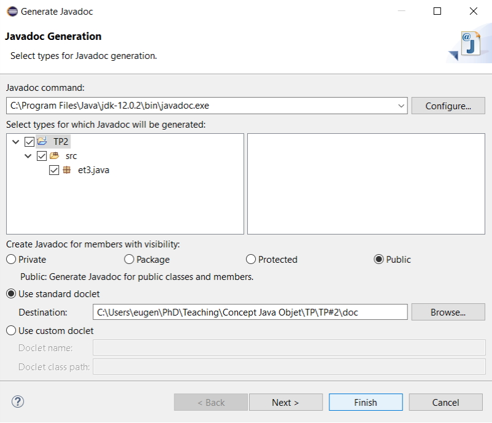
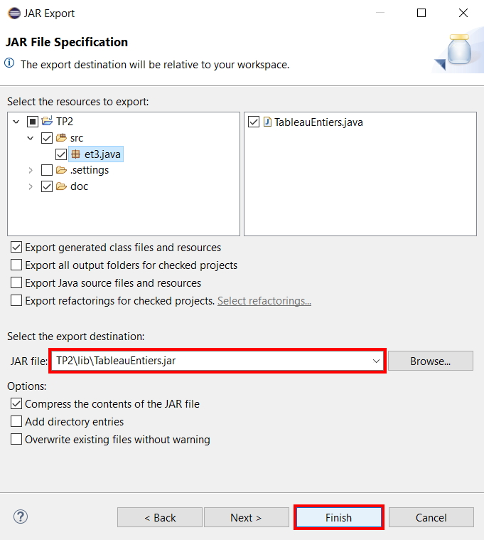

Programmation Java @ Et3
Polytech Paris-Saclay | 2019-20

# TP2 

Vous allez développer une classe utilitaire en Java permettant de réaliser divers traitements sur des tableaux d’entiers.

2#1. Créez une classe au nom approprié dans un package pertinent. Ajoutez une méthode statique à votre classe permettant de créer un tableau d’entiers (int[]) à partir d’un tableau de chaı̂nes de caractères (String[]).

- 2#1.1 code de la classe

> ```Java
> package et3.java;
> 
> public class TableauEntiers
> {
> 	/**
> 	 * Cette méthode permet de transformer un tableau de chaînes de caractères en tableau d'entiers
> 	 * 
> 	 * @param tabString Le tableau de chaînes de caractères à transformer
> 	 * @return Le tableau d'entiers créé à partir du tableau de chaînes de caractères
> 	 */
> 	public static int[] creerTableauEntiers ( String [] tabString )
> 	{
> 		//On crée un tableau d'entiers ayant la même taille que le tableau de chaînes de caractères
> 		int [] tabInt = new int [tabString.length];
> 		
> 		//On parcours le tableau de chaînes de caractères
> 		for(int indice = 0; indice < tabString.length; indice++)
> 		{
> 			//On tente d'éxécuter le code ci-dessous
> 			try
> 			{
> 				//On parse l'élément i du tableau de chaînes de caractère en entier
> 				//On associe cet entier à l'élément i du tableau d'entiers
> 				tabInt[indice] = Integer.parseInt(tabString[indice]);
> 			}
> 			//Si le code du "try" renvoie une erreur "NumberFormatException", on execute le code ci-dessous
> 			catch(NumberFormatException exception)
> 			{
> 				//On informe l'utilisateur que tabString[indice] ne peut pas être transformé en entier
> 				System.out.println("La valeur " + tabString[indice] + " d'indice " 
> 						+ indice + " ne peut pas être transformée en entier");
> 				System.out.println("Cette valeur sera donc remplacée par 0 dans le tableau");
> 				
> 				//On donne la valeur 0 à l'indice i du tableau d'entier
> 				tabInt[indice] = 0;
> 			}
> 		}
> 		
> 		//On retourne le tableau d'entiers
> 		return tabInt;
> 	}
> }
> ```

- 2#1.2 Pourquoi est-il utile d'associer notre classe à un package ?

> Il est utile d'associer notre classe à un package pour deux raisons principales :
> - cela permet de mieux organiser notre code en regroupant les classes par thème;
> - il est possible de rendre visible certains éléments uniquement pour les classes d'un même package.

- 2#1.3 Comment la méthode de conversion doit-elle se comporter en cas de problème de conversion, i.e. si une des chaı̂nes du tableau ne peut pas être convertie en entier à l’exécution ?

> Dans notre cas, il est souhaitable d'associer une valeur à chaque indice du tableau d'entiers. Nous allons donc associer la valeur 0 à l'éléement du tableau d'entiers concerné pour éviter les futures erreurs. Dans un soucis de transparence, il est cependant important d'en notifier l'utilisateur.
> 
> ```Java
> //On informe l'utilisateur que tabString[indice] ne peut pas être transformé en entier
> System.out.println("La valeur " + tabString[indice] + " d'indice " 
> 	+ indice + " ne peut pas être transformée en entier.");
> System.out.println("Cette valeur sera donc remplacée par 0 dans le tableau.");
> 				
> //On donne la valeur 0 à l'indice i du tableau d'entier
> tabInt[indice] = 0;
> ```

2#2. Ajoutez une méthode main à cette classe pour tester la méthode précédente en lui transmettant le tableau de paramètres lu depuis la ligne de commandes.

- 2#2.1 méthode main

> ```Java
> public static void main(String[] args) 
> {
> 	//On crée notre tableau d'entiers à partir de notre tableau de chaînes de caractères
> 	int[] tabInt = creerTableauEntiers(args);
> }
> ```
> 
> Pour tester le programme en ligne de commande, on utilise la commande [java](https://docs.oracle.com/javase/7/docs/technotes/tools/windows/java.html). Dans notre cas, on obtient :
> ```
> ...\TP#2\bin>java et3/java/TableauEntiers "15" "6" "4"
> ```

2#3. Ajoutez une méthode de classe affichant le contenu d’un tableau d’entiers passé en paramètres.

- 2#3.1 méthode ajoutée

> ```Java
> /**
>  * Cette méthode permet d'afficher le contenu d'un tableau d'entiers dans la console
>  * 
>  * @param tabInt Le tableau d'entiers à afficher
>  */
> public static void afficherTableau(int[] tabInt)
> {
> 	//Avec l'instruction "for"
> 	String sortie = "Avec l'instruction \"for\" : tabInt = ";
> 	for(int indice = 0; indice < tabInt.length; indice++)
> 	{
> 		sortie += tabInt[indice] + " ";
> 	}
> 	System.out.println(sortie);
> 	
> 	//Avec l'instruction "for each"
> 	sortie = "Avec l'instruction \"for each\" : tabInt = ";
> 	for(int entier:tabInt)
> 	{
> 		sortie += entier + " ";
> 	}
> 	System.out.println(sortie);
> 	
> 	//Avec la méthode "toString()" de la classe "Arrays"
> 	sortie = "Avec la methode \"toString()\" de la classe \"Arrays\" : tabInt = ";
> 	sortie += java.util.Arrays.toString(tabInt);
> 	System.out.println(sortie);
> }
> ```
> 
> Dans le cas ou on utilise la méthode [toString()](https://docs.oracle.com/javase/7/docs/api/java/util/Arrays.html#toString(int[])) de la classe Arrays, on a à faire à une surcharge (cette méthode est définie pour plusieurs types de tableaux : int[], boolean[], String[], ...)

- 2#3.2 Que se passe-t-il au niveau de la machine virtuelle en cas de dépassement de lecture des éléments d’un tableau, par exemple dans la méthode précédente ? Pourquoi ceci n’a-t-il pas mené à une erreur de compilation ?

> Si on modifie la partie concernant l'instruction `for` de la méthode précédente (e.g. on remplace le `<` par un `<=`), cela nous donne :
> 
> ```Java
> //Avec l'instruction "for"
> String sortie = "Avec l'instruction \"for\" : tabInt = ";
> for(int indice = 0; indice <= tabInt.length; indice++)
> {
> 	sortie += tabInt[indice] + " ";
> }
> System.out.println(sortie);
> ```
> 
> Lorsqu'on fait tourner le code, une erreur est soulevée :
> 
> ```Java
> Exception in thread "main" java.lang.ArrayIndexOutOfBoundsException: Index 0 out of bounds for length 0
> 	at et3.java.TableauEntiers.afficherTableau(TableauEntiers.java:71)
> 	at et3.java.TableauEntiers.main(TableauEntiers.java:95)
> ```
> 
> L'erreur obtenue est une exception de type [ArrayIndexOutOfBoundsException](https://docs.oracle.com/javase/7/docs/api/java/lang/ArrayIndexOutOfBoundsException.html). On peut remarquer que c'est une [RuntimeException](https://docs.oracle.com/javase/7/docs/api/java/lang/RuntimeException.html), ce qui veut dire qu'elle n'apparaîtra pas lors de la compilation de notre programme mais uniquement lors de son éxécution.

2#4. Ajoutez une méthode à la classe retournant la valeur maximale des valeurs d’un tableau d’entiers passé en paramètre. Pensez à une valeur adaptée dans le cas d'un tableau vide.

- 2#4.1 méthode ajoutée

> ```Java
> /**
>  * Cette méthode permet d'obtenir le maximum d'un tableau d'entiers
>  * 
>  * @param tabInt Le tableau d'entiers
>  * @return Le maximum du tableau d'entiers
>  */
> public static int obtenirMaximum(int[] tabInt)
> {
> 	int maximum;
> 	
> 	//Si le tableau d'entiers possède au moins 1 élément
> 	if(tabInt.length > 0)
> 	{
> 		//Au début, on définit le maximum comme étant le premier élément du tableau d'entiers
> 		maximum = tabInt[0];
> 		
> 		//On parcours le tableau d'entiers à partir du deuxième élément
> 		for(int indice = 1; indice < tabInt.length; indice++)
> 		{
> 			//Si l'élément du tableau d'entiers à la position indice est supérieur au maximum
> 			if(tabInt[indice] > maximum)
> 			{
> 				//L'élément du tableau d'entiers à la position indice devient le nouveau maximum
> 				maximum = tabInt[indice];
> 			}
> 		}
> 	}
> 	//Si le tableau d'entiers ne possède aucun élément
> 	else
> 	{
> 		//On informe l'utilisateur que le tableau d'entiers est vide
> 		System.out.println("Le tableau d'entiers est vide, la valeur du maximum est donc Integer.MIN_VALUE");
> 		
> 		//On définie notre maximum comme étant 0
> 		maximum = Integer.MIN_VALUE;
> 	}
> 	//On retourne le maximum
> 	return maximum;	
> }
> ```

- 2#4.2 test de la méthode ajoutée

> On transforme la méthode `main()` pour tester la méthode `obtenirMaximum(int[] tabInt)` :
> ```Java
> public static void main(String[] args) 
> {
> 	//On crée notre tableau d'entiers à partir de notre tableau de chaînes de caractères
> 	int[] tabInt = creerTableauEntiers(args);
> 	
> 	//On affiche le maximum du tableau d'entiers
> 	System.out.println(obtenirMaximum(tabInt));
> }
> ```
> 
> On obtient le resultat suivant lorsqu'on éxécute le code avec un exemple de tableau rempli :
> ```
> ...\TP\TP#2\bin>java et3/java/TableauEntiers "15" "6" "4"
> 15
> ```
> 
> On obtient le resultat suivant lorsqu'on éxécute le code avec un exemple de tableau vide :
> ```
> ...\TP\TP#2\bin>java et3/java/TableauEntiers
> Le tableau d'entiers est vide, la valeur du maximum est donc Integer.MIN_VALUE
> -2147483648
> ```

2#5. On souhaite ajouter une méthode de classe qui permettrait d’échanger la valeur minimale d’un premier tableau d’entiers transmis en paramètre avec la valeur maximale d’un second tableau d’entiers.

- 2#5.1 méthode ajoutée si cela est possible

> Copier une référence d’objet ne crée pas un nouvel objet, juste une nouvelle référence vers le même objet (synonymie des accès). Il est donc  possible d'implémenter la méthode demandée :
> ```Java
> /**
>  * Cette méthode permet d'échanger la valeur du minimum d'un tableau d'entiers avec le maximum d'un autre
>  * 
>  * @param tabInt1 Le premier tableau d'entiers (minimum)
>  * @param tabInt2 Le deuxième tableau d'entiers (maximum)
>  * @return VRAI si l'échange a eu lieu et FAUX sinon
>  */
> public static boolean echangerMinTabInt1EtMaxTabInt2(int[] tabInt1, int[] tabInt2)
> {
> 	int indiceMinimumTabInt1;
> 	int indiceMaximumTabInt2;
> 	
> 	//Si les tableaux d'entiers possèdent tous les deux au moins 1 élément
> 	if(tabInt1.length > 0 && tabInt2.length > 0)
> 	{
> 		//Au début, on définit le minimum de tabInt1 comme étant son premier élément
> 		indiceMinimumTabInt1 = 0;
> 		
> 		//On parcours tabInt1 à partir du deuxième élément
> 		for(int i1 = 1; i1 < tabInt1.length; i1++)
> 		{
> 			//Si l'élément de tabInt1 à la position i1 est inférieur au minimum
> 			if(tabInt1[i1] < tabInt1[indiceMinimumTabInt1])
> 			{
> 				//L'élément de tabInt1 à la position i1 devient le nouveau minimum
> 				tabInt1[indiceMinimumTabInt1] = tabInt1[i1];
> 				indiceMinimumTabInt1 = i1;
> 			}
> 		}
> 		
> 		//Au début, on définit le maximum de tabInt2 comme étant son premier élément
> 		indiceMaximumTabInt2 = 0;
> 		
> 		//On parcours tabInt2 à partir du deuxième élément
> 		for(int i2 = 1; i2 < tabInt2.length; i2++)
> 		{
> 			//Si l'élément de tabInt2 à la position i2 est supérieur au maximum
> 			if(tabInt2[i2] > tabInt2[indiceMaximumTabInt2])
> 			{
> 				//L'élément de tabInt2 à la position i2 devient le nouveau maximum
> 				indiceMaximumTabInt2 = i2;
> 			}
> 		}
> 		
> 		//On échange les deux valeurs
> 		int temp = tabInt1[indiceMinimumTabInt1];
> 		tabInt1[indiceMinimumTabInt1] = tabInt2[indiceMaximumTabInt2];
> 		tabInt2[indiceMaximumTabInt2] = temp;
> 		
> 		//On retourne "vrai" car l'échange a bien eu lieu
> 		return true;
> 	}
> 	//Si au moins un des deux tableaux d'entiers ne possède aucun élément
> 	else
> 	{
> 		//On retourne "faux" car l'échange n'a pas eu lieu
> 		return false;
> 	}
> }	
> ```

- 2#5.2 test de la méthode ajoutée

> On transforme la méthode `main()` pour tester la méthode `echangerMinTabInt1EtMaxTabInt2(int[] tabInt1, int[] tabInt2)` :
> ```Java
> public static void main(String[] args) 
> {
> 	//On crée nos tableaux d'entiers
> 	int tabInt1 [] = {1, 2, 3, 4, 5};
> 	int tabInt2 [] = {6, 7, 8, 9, 1};
> 	
> 	//On affiche lest tableaux
> 	afficherTableau(tabInt1);
> 	afficherTableau(tabInt2);
> 	
> 	//On échange les valeurs (minimum tabInt1 <=> maximum tabInt2)
> 	System.out.println(echangerMinTabInt1EtMaxTabInt2(tabInt1, tabInt2));
> 	
> 	//On affiche lest tableaux
> 	afficherTableau(tabInt1);
> 	afficherTableau(tabInt2);
> }
> ```
> 
> Dans un soucis de lecture, on crée la méthode `afficherTableauPourTest()` :
> ```Java
> /**
>  * Cette méthode permet d'afficher le contenu d'un tableau d'entiers dans la console
>  * Elle est simplifiée par rapport à la méthode {@link TableauEntiers#afficherTableau(int[] tabInt)}
>  * 
>  * @param tabInt Le tableau d'entiers à afficher
>  */
> public static void afficherTableauPourTest(int[] tabInt)
> {
> 	String sortie = "tabInt = ";
> 	sortie += java.util.Arrays.toString(tabInt);
> 	System.out.println(sortie);
> }
> ```
> 
> Lorsqu'on éxécute le code, on obtient le résultat suivant :
> ```
> tabInt = [1, 2, 3, 4, 5]
> tabInt = [6, 7, 8, 9, 1]
> true
> tabInt = [9, 2, 3, 4, 5]
> tabInt = [6, 7, 8, 1, 1]
> ```

2#6. On souhaite maintenant ajouter une méthode de classe qui retourne la somme des entiers transmis en acceptant un nombre quelconque d’entiers directement en paramètres de la méthode.

- 2#6.1 méthode ajoutée si cela est possible

> On utilise la notation `Type...` en paramètre de méthode pour permettre un nombre variables de paramètres. Le paramètre qui sera récupéré dans la méthode sera de type `Type[]` (dans la documentation, il faut chercher [Varargs](https://docs.oracle.com/javase/8/docs/technotes/guides/language/varargs.html)).
> ```Java
> /**
>  * Cette méthode permet d'additionner plusieurs entiers
>  * 
>  * @param entiers Les entiers à additionner
>  * @return La somme des entiers
>  */
> public static int sommeEntiers (int... entiers)
> {
> 	int somme = 0;
> 	
> 	//On parcours les entiers passés en paramètre
> 	for (int entier : entiers)
> 	{
> 		//On ajoute chaque entier à la somme
> 		somme += entier ;
> 	}
> 	
> 	//On retourne la somme des entiers
> 	return somme ;
> }
> ```

- 2#6.2 test de la méthode ajoutée

> On transforme la méthode `main()` pour tester la méthode `sommeEntiers(int... entiers)` :
> ```Java
> public static void main(String[] args) 
> {
> 	//On crée notre tableau d'entiers à partir de notre tableau de chaînes de caractères
> 	int[] tabInt = creerTableauEntiers(args);
> 	
> 	//On affiche la somme de entiers : 1, 5, 8 et 30
> 	System.out.println(sommeEntiers(1,5,8,30));
> }
> ```

2#7. Créez un fichier JAR ne contenant que le code compilé de votre classe, et utilisez-le dans la méthode main d’une nouvelle classe d'un autre package de votre choix. Créez automatiquement la documentation Javadoc de votre classe.

- 2#7.1 nouvelle classe ajoutée

```Java
Test
```

- 2#7.2 Quelles sont les étapes pour la création de la Javadoc et de l'archive JAR ?

On commence par générer la Javadoc :
- on va dans le menu et on selectionne `Project > Generate Javadoc`;
</img>
- une fenêtre s'ouvre, on peut changer plusieurs paramètres tels que la partie du projet pour laquelle on veut générer la Javadoc ou la location de la Javadoc sur le disque;
</img>
- on valide en cliquant sur `Finish`;
- on remarque que la Javadoc a été créée dans notre projet.
</img>

Ensuite, on génére l'archive JAR :
- on fait un clic droit sur le projet en cours dans le `Package Explorer` et on clique sur `Export...`;
</img>
- on selectionne `JAR file` puis on clique sur `Next >`;
</img>
- on vérifie que la classe `TableauEntiers` est effectivement sélectionnée, on choisit la destination du fichier qui va être généré puis on valide en cliquant sur `Finish`;
</img>
- on peut faire un clic droit sur le projet en cours dans le `Package Explorer` et selectionner `Refresh` pour actualiser le projet.
</img>

Finalement, il nous faut ajouter l'archive JAR à notre projet pour pouvoir l'utiliser :
- on fait un clic droit sur le projet en cours dans le `Package Explorer` et on clique sur `Properties`;
</img>
- on selectionne `Java Build Path` dans la fenêtre qui apparaît puis on clique sur `Add JARs...` (`Add External JARs...` si l'archive est extérieur au projet);
</img>
- on selectionne notre archive et on clique sur `OK`;
</img>
- on vérifie que l'archive a correctement été ajoutée et on clique sur `Apply and Close`;
</img>
- on appelle l'archive dans notre nouvelle classe en utilisant l'instruction `import`.
```Java
import et3.java.TableauEntiers;
```

| Transmettre par courrier électronique ||
| :---: | :--- | 
|to|eugenie.brasier@inria.fr|
|title|[Polytech > Et3] TP2_NOM_Prenom|
|attached|TP2_NOM_Prenom.pdf|
